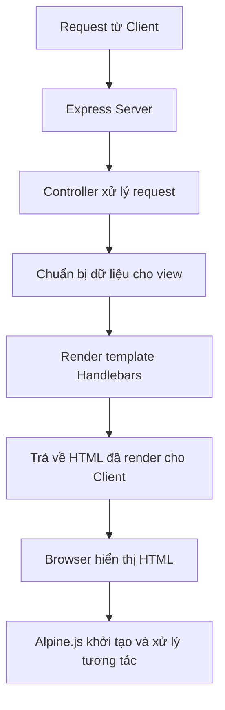
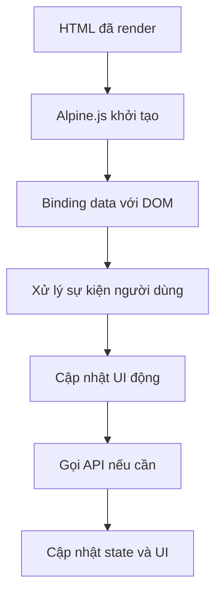
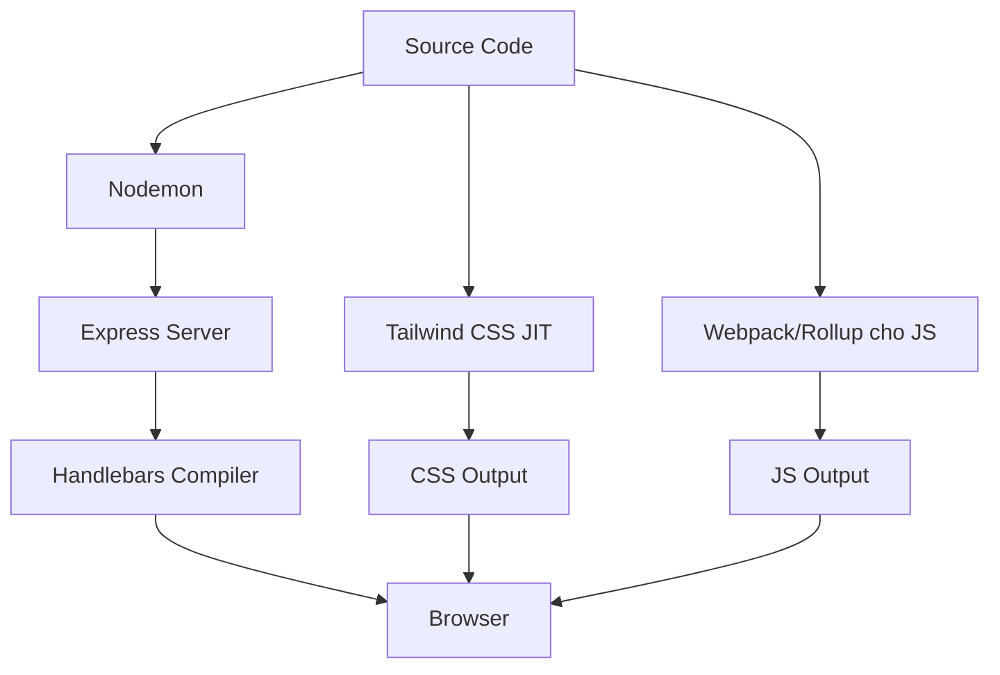
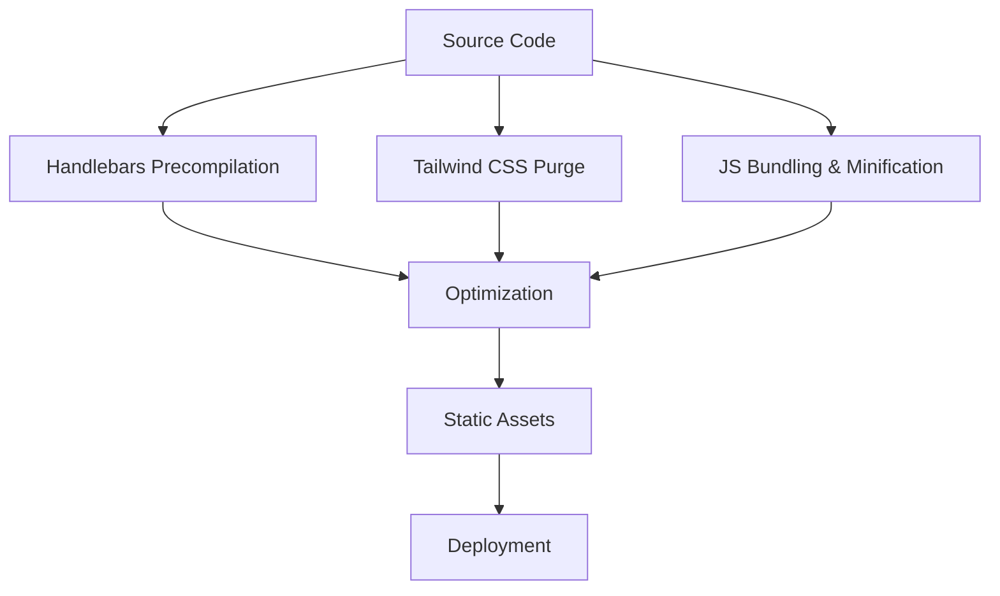
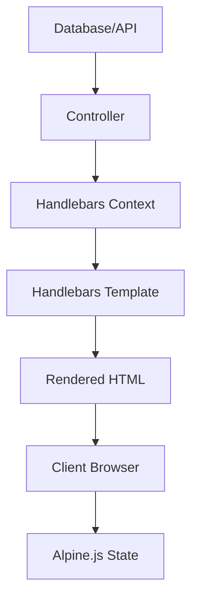
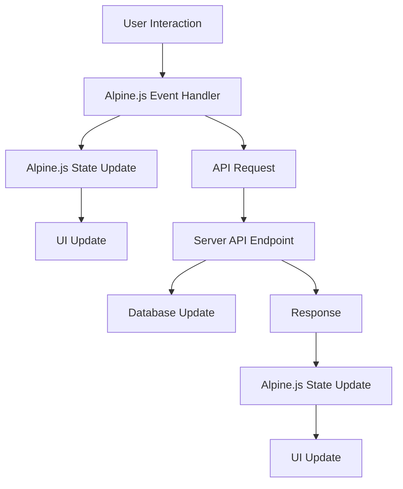

# Quy Trình Hoạt Động và Build Process

Tài liệu này mô tả chi tiết về quy trình hoạt động và build process của hệ thống front-end sử dụng Handlebars, Alpine.js và Tailwind CSS.

## Quy Trình Hoạt Động

### 1. Server-Side Rendering với Handlebars

1. **Request từ Client**: Người dùng truy cập một URL.
2. **Express Server**: Server nhận request.
3. **Controller xử lý request**: Controller tương ứng xử lý request.
4. **Chuẩn bị dữ liệu cho view**: Controller chuẩn bị dữ liệu cần thiết cho view.
5. **Render template Handlebars**: Server sử dụng Handlebars để render template với dữ liệu đã chuẩn bị.
6. **Trả về HTML đã render cho Client**: Server trả về HTML đã được render đầy đủ.
7. **Browser hiển thị HTML**: Browser hiển thị HTML nhận được.
8. **Alpine.js khởi tạo và xử lý tương tác**: Alpine.js khởi tạo và xử lý các tương tác phía client.

### 2. Client-Side Interaction với Alpine.js

1. **HTML đã render**: Browser nhận HTML đã được render từ server.
2. **Alpine.js khởi tạo**: Alpine.js khởi tạo và tìm các element có directive Alpine.js.
3. **Binding data với DOM**: Alpine.js bind data với DOM elements.
4. **Xử lý sự kiện người dùng**: Alpine.js xử lý các sự kiện người dùng (click, input, etc.).
5. **Cập nhật UI động**: UI được cập nhật động dựa trên tương tác của người dùng.
6. **Gọi API nếu cần**: Nếu cần, Alpine.js có thể gọi API để lấy hoặc cập nhật dữ liệu.
7. **Cập nhật state và UI**: State được cập nhật và UI được render lại.

## Build Process

### 1. Development Environment

1. **Nodemon**: Theo dõi thay đổi trong source code và tự động restart server.
2. **Express Server**: Chạy server Express để phục vụ ứng dụng.
3. **Handlebars Compiler**: Biên dịch các template Handlebars thành HTML.
4. **Tailwind CSS JIT**: Sử dụng Just-In-Time compiler của Tailwind CSS để tạo CSS.
5. **Webpack/Rollup cho JS**: Bundling các file JS, bao gồm các Alpine.js components.

### 2. Production Build

1. **Handlebars Precompilation**: Precompile các template Handlebars để tăng hiệu suất.
2. **Tailwind CSS Purge**: Loại bỏ các CSS không sử dụng để giảm kích thước file CSS.
3. **JS Bundling & Minification**: Bundle và minify các file JS để giảm kích thước và tăng hiệu suất.
4. **Optimization**: Tối ưu hóa các static assets (hình ảnh, fonts, etc.).
5. **Deployment**: Deploy ứng dụng lên production server.

## Luồng Dữ Liệu

### 1. Server-to-Client Data Flow

1. **Database/API**: Dữ liệu được lấy từ database hoặc API.
2. **Controller**: Controller xử lý dữ liệu và chuẩn bị context cho Handlebars.
3. **Handlebars Context**: Context chứa dữ liệu cần thiết cho template.
4. **Handlebars Template**: Template sử dụng context để render HTML.
5. **Rendered HTML**: HTML đã được render với dữ liệu.
6. **Client Browser**: Browser hiển thị HTML.
7. **Alpine.js State**: Alpine.js khởi tạo state dựa trên dữ liệu từ HTML.

### 2. Client-to-Server Data Flow

1. **User Interaction**: Người dùng tương tác với UI.
2. **Alpine.js Event Handler**: Alpine.js xử lý sự kiện.
3. **Alpine.js State Update**: State được cập nhật.
4. **UI Update**: UI được cập nhật dựa trên state mới.
5. **API Request**: Nếu cần, Alpine.js gửi request đến API.
6. **Server API Endpoint**: Server xử lý request.
7. **Database Update**: Nếu cần, database được cập nhật.
8. **Response**: Server trả về response.
9. **Alpine.js State Update**: Alpine.js cập nhật state dựa trên response.
10. **UI Update**: UI được cập nhật dựa trên state mới.

## Tối Ưu Hóa Hiệu Suất

1. **Handlebars Precompilation**: Precompile các template Handlebars để tăng hiệu suất.
2. **Tailwind CSS Purge**: Loại bỏ các CSS không sử dụng để giảm kích thước file CSS.
3. **JS Bundling & Minification**: Bundle và minify các file JS để giảm kích thước và tăng hiệu suất.
4. **Lazy Loading**: Lazy load các components không cần thiết ngay lập tức.
5. **Caching**: Sử dụng caching để giảm số lượng requests và tăng hiệu suất.
6. **Code Splitting**: Chia nhỏ code thành các chunks để tải nhanh hơn.
7. **Tree Shaking**: Loại bỏ code không sử dụng để giảm kích thước bundle.